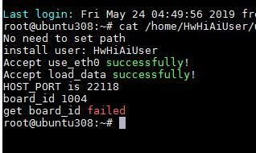

## 2.11 升级过程中提示get board_id failed
### 问题描述
使用MindSpore Studio在线升级功能升级Atlas 200 Developer Kit开发板过程中提示“check board_id failed to upgrade Mini...”升级错误，检查升级日志文件upgradeMini.log提示“get board_id failed”，如图1.1所示。

### 可能原因
在线升级过程中后台会检查Atlas 200 Developer Kit开发板的board_id，如果开发板的ID变更或有新增，会导致校验ID失败，从而升级失败。
### 解决方法
将Atlas 200 Developer Kit开发板的board_id写入配置文件，配置文件路径为“~/tools/scripts/upgradeMiniBoardId.conf”，升级过程中会将后台获取的board_id与该配置文件中board id值进行匹配，如果匹配到相应取值，则校验通过，允许升级。
举例说明：
如图1.1所示，board_id为1004，将该ID值写入“~/tools/scripts/upgradeMiniBoardId.conf”配置文件，保存关闭文件后，重新执行升级操作。
