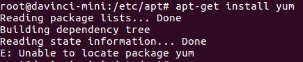

## 2.13 开发者板连网后通过apt-get命令安装软件失败
### 问题描述
开发者板参照6.2USB连接方式时如何配置开发者板通过MindSpore Studio服务器连接网络配置好网络后，执行在开发者板上执行apt-get install xxx命令下载软件时出现如下错误信息。

### 解决方法
出现此问题的原因可能是配置的Ubuntu源错误，开发者板是ARM Ubuntu操作系统，与X86的Ubuntu操作系统的源是不一样的，所以需要修改/etc/apt/sources.list文件中的源。
#### 步骤 1 备份sources.list文件。
sudo cp /etc/apt/sources.list /etc/apt/sources.list.bak
#### 步骤 2 编辑sources.list，将原文件内容删除，替换为如下源，然后保存退出。
deb http://mirrors.aliyun.com/ubuntu-ports/ xenial main 
deb-src http://mirrors.aliyun.com/ubuntu-ports/ xenial main 
deb http://mirrors.aliyun.com/ubuntu-ports/ xenial-updates main 
deb-src http://mirrors.aliyun.com/ubuntu-ports/ xenial-updates main 
 deb http://mirrors.aliyun.com/ubuntu-ports/ xenial universe 
deb-src http://mirrors.aliyun.com/ubuntu-ports/ xenial universe 
deb http://mirrors.aliyun.com/ubuntu-ports/ xenial-updates universe 
deb-src http://mirrors.aliyun.com/ubuntu-ports/ xenial-updates universe 
deb http://mirrors.aliyun.com/ubuntu-ports/ xenial-security main 
deb-src http://mirrors.aliyun.com/ubuntu-ports/ xenial-security main 
deb http://mirrors.aliyun.com/ubuntu-ports/ xenial-security universe 
deb-src http://mirrors.aliyun.com/ubuntu-ports/ xenial-security universe
#### 步骤 3 运行sudo apt-get update命令更新源。
至此，就可以正常使用apt-get install命令来安装所需要的软件了。
----结束
