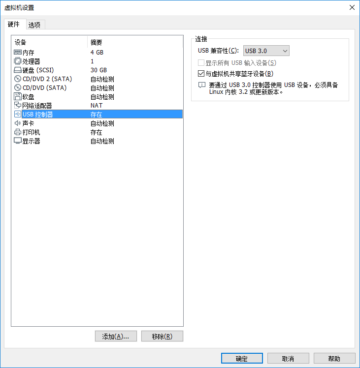

## 2.6 VMWare虚拟机环境下Ubuntu连接开发者板（USB）后ifconfig查看无虚拟网卡出现
### 问题描述
VMWare虚拟机环境下Ubuntu连接开发者板（USB）后ifconfig查看无虚拟网卡出现。
### 解决方法
1.查看USB连接线是否正常。
若正常 => 2
若不正常，请更换USB连接线。
2.查看USB与虚拟机是否已经连接。
连接方法如下图所示。

3.如果已经设置USB连接至虚拟机，仍然不出现虚拟网卡，原因可能是VMWare中没有设置USB3.0兼容，请按照以下方法进行设置。
在VMWARE菜单栏中选择“虚拟机->设置”，打开虚拟机设置页面，然后USB兼容性选择“USB 3.0”，如下图所示。

然后再执行ifconfig命令查看IP即可。
