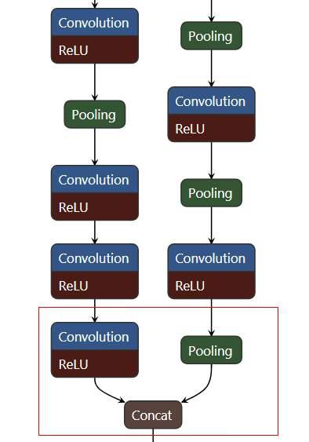
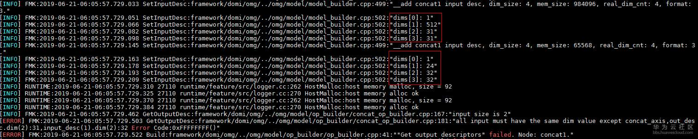
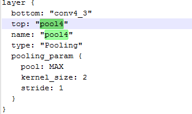

## 3.7 Caffe模型转换时提示all input must have the same dim value
### 问题描述
caffe模型转换失败，报错信息如下：
[ERROR] FMK:2019-06-21-06:05:57.729.503 GetOutputDesc:framework/domi/omg/../omg/model/op_builder/concat_op_builder.cpp:181:"all input must have the same dim value except concat_axis,out_desc.dim(2):31,input_desc(1).dim(2):32 Error Code:0xFFFFFFFF()" 
[ERROR] FMK:2019-06-21-06:05:57.729.522 Build:framework/domi/omg/../omg/model/op_builder/op_builder.cpp:41:""Get output descriptors" failed. Node: concat1." 
[ERROR] FMK:2019-06-21-06:05:57.729.536 SetInputOutputDesc:framework/domi/omg/../omg/model/model_builder.cpp:594:"Op build failed. Node: concat1." 
[ERROR] FMK:2019-06-21-06:05:57.729.555 Build:framework/domi/omg/../omg/model/model_builder.cpp:2868:"SetInputOutputDesc Failed!" 
[ERROR] FMK:2019-06-21-06:05:57.729.568 Generate:framework/domi/omg/omg.cpp:800:"OMG builder Build() return fail." 
[ERROR] FMK:2019-06-21-06:05:57.732.193 main:framework/domi/omg_main/main.cpp:815:"OMG Generate execute failed!!"
### 解决方法
从上面的出错信息可以看出，是因为网络中的某一层的输入维度不对导致无法进行计算，又由于报错文件是concat_op_builder.cpp，可推断是concat计算时的两个输入维度不匹配导致转换失败。
此网络的第一个输入数据的维度是31， 第二个数据维度的输入时32，那么需要从日志中分析是从网络中的哪一层开始不匹配的。
#### 步骤 1 
    将模型文件****.prototxt用Netron打开来分析。

最后一层concat的输入是一个卷积操作的输出和一个pooling的输出。
#### 步骤 2 
    查看模型转换日志，从后往前进行分析。
concat层的输入是【1,24,31,31】和【1,512,32，32】，显然无法进行计算。

然后继续往前查找，如下图所示，发现在左边分支最后一个pooling层的输入是【1,512,32,32】，经过计算后输出变成了【1,512,31,31】，是在该层导致了维度的变化（后面的几层卷积操作维度都没有发生变化）。

接下来需要查看pooling层是否有错误。

#### 步骤 3 
    查看prototxt文件，发现kernel_size为2，stride为1，相当于是重叠，维度少1，所以怀疑模型文件多了这一层pooling或者是右边分支少了这一层pooling。

#### 步骤 4 
    根据模型文件的确认结果将左侧pooling层删除，或者在右侧增加pooling层，也可以重新在caffe下训练并给出正确的模型文件再进行模型转换。
----结束

