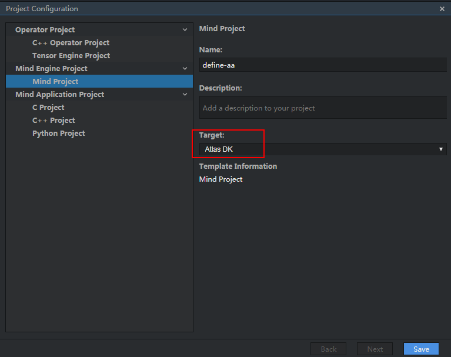

## 4.1 编排流程运行失败常见问题检查思路
### 问题描述
编排流程运行时如果出现以下错误：
CreateGraph init failed
can't connect the remote host...
no result file generated
remote_open failed，sock-1
remote_handle failed, err -1
...
### 解决方法
按照以下步骤进行排查：
#### 步骤 1检查工程类型是否是Atlas DK。
选择工程，在菜单栏选择File > Project Configuration，查看工程的Target是否为Atlas DK。

如果是Atlas DK =>步骤2。
如果不是Atlas DK，请修改工程类型。

#### 步骤 2检查MindSpore Studio与Atlas DK开发板的网络连接。
在MindSpore Studio服务器中执行ping 192.168.1.2检查MindSpore Studio与开发板是否连通。
如果连通，请执行 => 步骤3。
如果不连通，请参考《Ascend 310 Atlas 200 Developer Kit 使用指导》检查MindSpore Studio与开发板的连接。

#### 步骤 3检查开发板时间与MindSpore Studio时间是否一致。
MindSpore Studio与Atlas DK开发板之间存在证书认证，如果MindSpore Studio与Atlas DK时间不一致，会导致认证失败，MindSpore Studio与Atlas DK开发板之间无法进行消息通信。
分别在MindSpore Studio服务器与开发板行执行date命令，检查二者时间是否一致。
如果时间一致，请执行 =>步骤4。
如果时间不一致，请执行date -s 01/16/2019命令进行修改。

#### 步骤 4检查编排流程中的图片预处理节点的resize大小是否与模型要求大小一致。
可通过以下两种方法查看网络模型对图片的大小要求：
	通过MindSpore Studio导入网络模型时，通过如图4-2所示参数获取模型对图片高和宽的要求。
    

上图所示的H与W的值分别为此导入模型对处理的图片高和宽的要求。
	通过查看网络模型的prototxt文件的input_param参数。
layer { 
  name: "input" 
  type: "Input" 
  top: "data" 
  input_param { 
    # These dimensions are purely for sake of example; 
    # see infer.py for how to reshape the net to the given input size. 
    shape { dim: 1 dim: 3 dim: 500 dim: 500 } 
  } 
}
如上所示，input_param中shape的后两个参数即为模型要求的高和宽。
设置ImagePreProcess节点的Resize属性的高和宽的值分别为上述模型要求的高和宽。
#### 步骤 5以上配置检查完后，重新运行编排流程。
----结束

