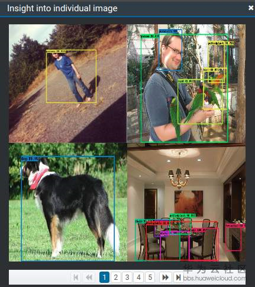
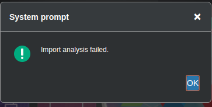
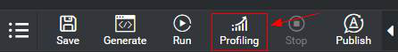

## 4.11 在MindSpore Studio中执行Profiling报Import analysis failed的错误
### 问题描述
运行fast_rcnn_vgg16网络的应用程序，程序提示运行成功。

右键单击后处理节点，可选择查看statistical evaluation和Image Result的结果，如下图所示：

在后处理节点上右键单击Profiling时，报如下错误：

### 解决方法
在后处理节点上查看Profilling分析结果前，需要先运行Profiling，如下图所示。

然后再在后处理节点上右键单击Profiling查看结果。

