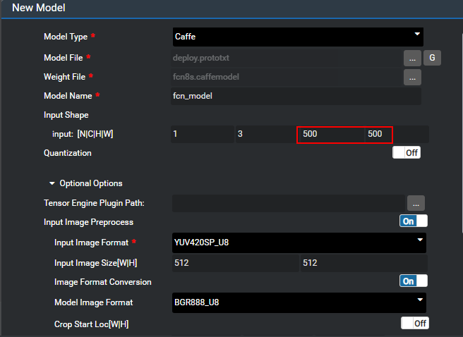

## 4.2 应用fcn8s模型执行语义分割流程推理结果不正确
### 问题描述
通过MindSpore Studio模型导入功能导入fcn网络模型成功。
执行如下推理流程，输出日志报执行成功，但模型推理结果为0，输出结果错误，推理流程如图4-3所示。

### 解决方法
推理失败的原因为图片预处理节点ImagePreProcess的resize设置不对，Resize需要设置为网络模型要求的高和宽。
#### 步骤 1查看模型要求的高和宽。
可通过以下两种方法查看网络模型对图片的大小要求：
通过MindSpore Studio导入网络模型时，通过如图4-4所示参数获取模型对图片高和宽的要求。

上图所示的H与W的值分别为此导入模型对处理的图片高和宽的要求。
通过查看网络模型的prototxt文件的input_param参数。
layer { 
  name: "input" 
  type: "Input" 
  top: "data" 
  input_param { 

//These dimensions are purely for sake of example; 

//see infer.py for how to reshape the net to the given input size. 

​    shape { dim: 1 dim: 3 dim: 500 dim: 500 } 
  } 
}
如上所示，input_param中shape的后两个参数即为模型要求的高和宽。

#### 步骤 2设置图片预处理节点的resize属性。
设置ImagePreProcess节点的Resize属性的width与height分别为步骤1中的宽与高。

----结束
