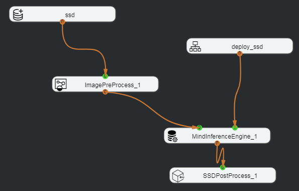
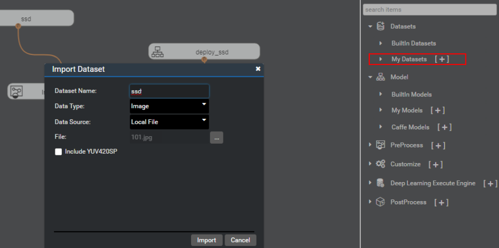
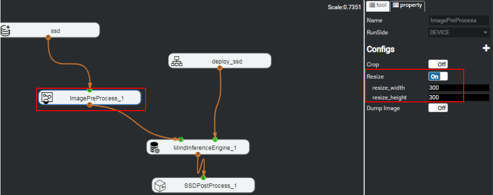

## 4.4 应用ssd网络模型执行检测器程序无运行结果
### 问题描述
使用训练的ssd检测器进行场景文字检测，模型能够导入成功，但无法在post process节点查看输出。
编排流程如图4-11所示。

### 解决方法
流程编排Engine部署正确，并确保工程类型正确且网络连通的情况下检查关键配置。
	ssd为My Datasets中导入的类型是Image的数据集，如图4-12所示。

	depoy_ssd为My Model中导入的模型，配置如图4-13所示。

其中模型对输入图片的高和宽要求分别为300*300。
修改ImagePreProcess节点的Resize，与模型要求尺寸保持一致，如图4-14所示。

以上配置正确后，重新运行编排流程，运行成功。右键单击后处理节点“SSDPostProcess”，选择“image result”，可以看到图片处理结果。
