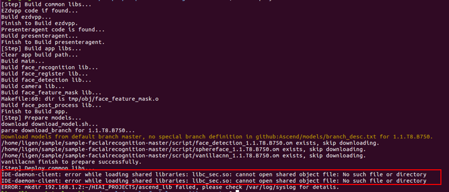
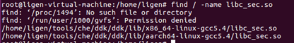

## 4.6 部署人脸识别应用程序时，deploy.sh脚本出错
### 问题描述
人脸识别应用程序，执行deploy.sh脚本时，提示：IDE-daemon-client: error while loading shared libraries: lib_sec.so: cannot open shared object file: No such file or directory，如下图所示。

### 解决方法
1.搜索当前系统中是否存在lib_sec.so文件，如下图所示。
图4-18MindSpore Studio所在服务器中搜索lib_sec.so文件

如上图所示，该文件存在于$HOME/tools/che/ddk/ddk/lib路径中。
该文件存在但程序却无法找到，所以推测环境变量未设置。
2.在~/.bashrc中设置如下环境变量即可。
export DDK_HOME=$HOME/tools/che/ddk/ddk
export LD_LIBRARY_PATH=$DDK_HOME/uihost/lib

