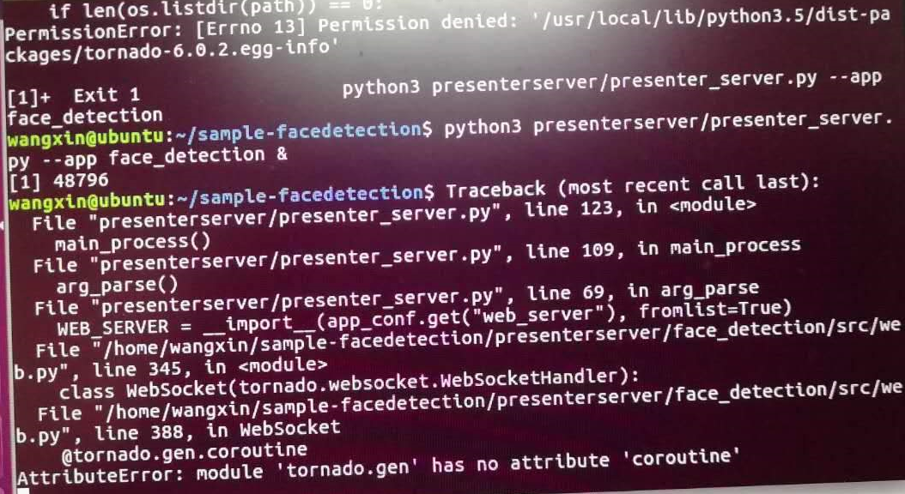

## 4.7 Presenter Server启动时报Permission denied:xxx/tornado-6.0.2.egg-info
### 问题描述
Presenter Server服务启动时报“Permission denied: '/usr/local/lib/python3.5/dist-packages/tornado-6.0.2.egg-info"，如下图所示。

### 解决方法
由报错可以看到，已安装的tornado库是6.0.2版本的，该版本下tornado.gen没有coroutine属性。推测安装版本不对。与可以正确启动presenter server的Ubuntu里安装的tornado对比后发现，实际需要5.1版本的。
所以卸载原有tornado库安装5.1版本即可。
pip3 uninstall tornado
Pip3 install tornado==5.1
