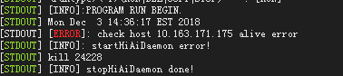
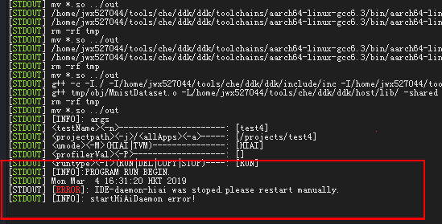

## 4.8 远程执行run用例时提示alive error
### 问题描述
若MindSpore Studio与Host不在同一台机器，单击MindSpore Studio界面的run执行应用时，提示如下错误。

### 问题原因
IDE-daemon启动时会监听静态IP，如果未设置IP，导致MindSpore Studio无法运行应用程序。
### 解决方案
请将Host侧IP配置成静态IP，打开系统IP配置文件，命令为：sudo vi /etc/network/interfaces，在打开的文件中加入如下内容。

