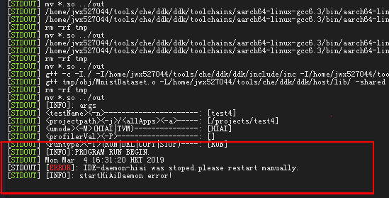

## 4.9 远程执行run用例时提示 IDE-daemon-hiai 进程停止
### 问题描述
单击MindSpore Studio界面的run执行应用程序时，提示如下错误。

### 问题原因
IDE-daemon-hiai进程是前处理数据回传时使用的，MindSpore Studio运行过程中，由于误操作或人为原因导致该进程停止。
### 解决方法
1. 以MindSpore Studio安装用户登录MindSpore Studio所在的服务器后台。
2. 执行如下命令设置环境变量。
export  LD_LIBRARY_PATH=~/tools/che/ddk/ddk/uihost/lib 
export  PATH=$PATH:~/tools/che/ddk/ddk/uihost/bin
3. 执行如下命令，重新启动IDE-daemon-hiai进程：
cd ~/tools/che/ddk/ddk/uihost/bin
./IDE-daemon-hiai
